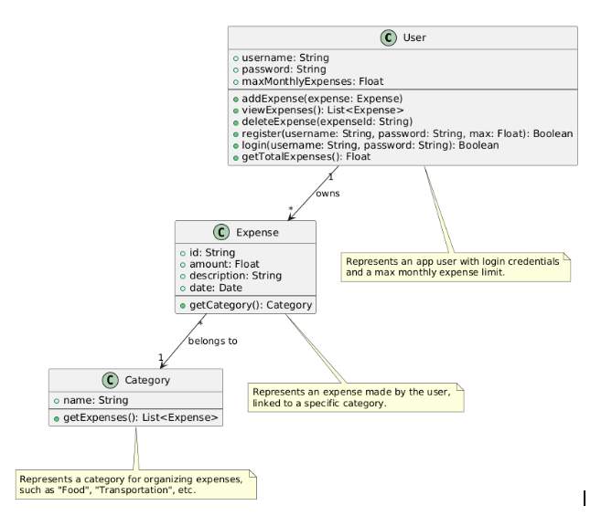

# Expense Tracker Web Application

## Idea
Create a web application that allows users to track their expenses and get notified when they exceed a predefined budget.

## Technologies
- **Backend:** .NET 8
- **Frontend:** Angular 18
- **Database:** MongoDB
- **Styling:** TailwindCSS

## Features
- **Authentication:** Multiple users can sign up, log in, and manage their expenses securely.
- **Realtime Calculation:** Dashboard updates in real-time to show the user's expenses and budget status.
- **Categories:** Custom categories for each user to organize their expenses.
- **Classification by Categories:** Users can categorize their expenses (e.g., Food, Rent, etc.).
- **Pie Chart:** A dynamic pie chart visualizes the expense distribution across different categories.
- **Realtime Notifications:** Notifications alert the user when they exceed their predefined budget.

## Class Diagram



## Setup Instructions

### 1. Clone the Project
First, clone the repository to your local machine:

```bash
git clone https://github.com/boudenjal-mohcine/ExpenseTracker
cd ExpenseTracker
```

### 2. Frontend (Angular)
Navigate to the Angular project directory and install the required dependencies:

```bash
cd expense-tracker-frontend
npm install
```

Once the dependencies are installed, start the Angular development server:

```bash
ng serve
```
The Angular frontend will be available at http://localhost:4200.

### 3. Backend (.NET)
Navigate to the backend project directory:

```bash
cd ExpenseTrackerApi
```

Run the .NET application:
```bash
dotnet run
```

### 4. Database (MongoDB)
MongoDB is shared, so you don't need to set up the database separately. The backend will connect to it automatically.

### 5. Environment Configuration (Optional)
If needed, configure the environment variables in the backend project. Ensure the MongoDB connection string and other configurations are correctly set in the appsettings.json.

### 6. Access the Application
Frontend: http://localhost:4200

## Features Not Implemented

- **UI Form for Categories**: The user interface form for adding and managing categories is not yet implemented.
- **CRUD Operations for Categories**: The functionality to Create, Read, Update, and Delete categories is currently not available.

## Other Information

- **Video**: [Project Demo](https://drive.google.com/file/d/1K0RjTm3mowIzocXzRJxsg1HSiiSg9DG0/view)
- **Email**: [boudenjalmohcine@gmail.com](mailto:boudenjalmohcine@gmail.com)
- **LinkedIn**: [Mohcine Boudenjal](https://www.linkedin.com/in/mohcineboudenjal/)
- **Phone**: +212701168663
